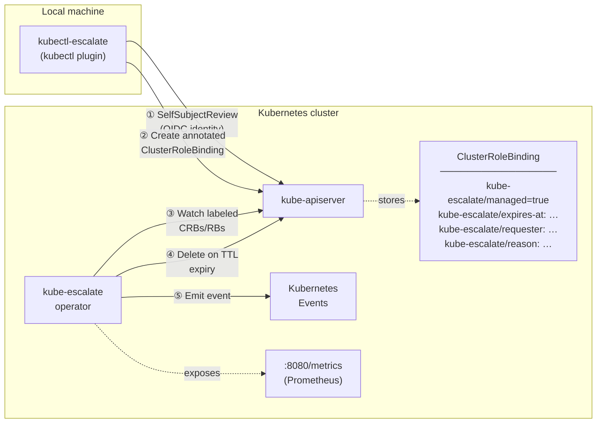

# Architecture

## Component diagram



## Escalation lifecycle

1. **Plugin** calls `SelfSubjectReviews().Create()`.
   The API server populates `Status.UserInfo.Username` and `Status.UserInfo.Groups`
   from the validated OIDC token — this value cannot be forged by the caller.

2. **Plugin** creates a `ClusterRoleBinding` (or `RoleBinding` for `--namespace`)
   annotated with the expiry timestamp, requester identity, and reason.
   The binding immediately grants the requested role.

3. **Operator** watches all objects labelled `kube-escalate/managed=true` via a
   controller-runtime predicate filter. Unmanaged CRBs are never enqueued.

4. **First reconcile** — operator adds the `kube-escalate.layer87.de/cleanup`
   finalizer and records creation metrics. The informer watch re-enqueues
   after the `Update`.

5. **Subsequent reconciles** — operator requeues at exactly `expiresAt + 1 s`.
   No polling window, no grace period.

6. **TTL elapsed** — operator calls `Delete`; because the finalizer is present
   the API server sets `DeletionTimestamp` instead of removing the object.

7. **Finalization** — operator checks whether `now > expiresAt`:
   - **Yes** → `Warning/EscalationExpired` event, `RecordExpiry` metrics
   - **No** (manual revocation via `revoke`) → `Normal/EscalationRevoked` event, `RecordRevocation` metrics
   Finalizer removed; object is garbage-collected.

## Finalizer lifecycle

```
reconcile 1   → add finalizer + RecordCreation
reconcile N   → TTL not elapsed → requeue at expiresAt + 1 s
reconcile N   → TTL elapsed    → client.Delete (sets DeletionTimestamp)
reconcile N+1 → DeletionTimestamp set → handleFinalization:
                  now > expiresAt  → EscalationExpired  + RecordExpiry
                  now ≤ expiresAt  → EscalationRevoked + RecordRevocation
                remove finalizer → object garbage-collected
```

## Security model

| Property | Enforcement |
| --- | --- |
| **Tamper-proof identity** | Requester read from `SelfSubjectReview` — populated by the API server, never from CLI arguments |
| **Automatic expiry** | Reconciler requeues at the exact expiry instant; no polling gap |
| **Least-privilege operator** | ClusterRole grants only `get/list/watch/update/patch/delete` on bindings — the operator can never *create* a binding |
| **No admission webhook** | No availability dependency; if the operator restarts, existing bindings remain until it reconciles |
| **No CRD** | Uses standard `rbac.authorization.k8s.io/v1` — works on any Kubernetes 1.26+ cluster |
| **No database** | All state lives in Kubernetes etcd |
| **Audit trail** | Every expiry and revocation emits a Kubernetes Event; requester and reason are stored as annotations |

## Prometheus metrics

All metrics are exposed on `:8080/metrics` by the operator and labelled
`{user, role, namespace}`.

| Metric | Type | Description |
| --- | --- | --- |
| `kube_escalate_active_escalations` | Gauge | Currently active escalations |
| `kube_escalate_escalations_total` | Counter | Total escalations created |
| `kube_escalate_expired_total` | Counter | Escalations deleted by TTL |
| `kube_escalate_revoked_total` | Counter | Escalations manually revoked |
| `kube_escalate_duration_seconds` | Histogram | Duration of completed escalations |

## Bootstrap order

```
1. Operator deployed (helm install)
   └─ Creates: ServiceAccount, ClusterRole, ClusterRoleBinding, Deployment

2. User has RBAC to use the plugin
   └─ Needs: create on selfsubjectreviews
             create on clusterrolebindings (and/or rolebindings)

3. Target role exists in the cluster
   └─ e.g. cluster-admin (built-in) or a custom ClusterRole
      The plugin only binds existing roles — it never creates them.
```

The plugin does **not** require the operator to be running at escalation time.
If the operator is down, the binding is created but will not be automatically
deleted until the operator restarts and reconciles.

## Known v1 limitations

| Limitation | Notes |
| --- | --- |
| **RoleBindings not watched** | The operator only watches `ClusterRoleBinding`. Namespace-scoped escalations created with `--namespace` will not auto-expire; they must be manually revoked. A second `Watches(&rbacv1.RoleBinding{}, …)` in `SetupWithManager` will fix this. |
| **Standard NetworkPolicy + Cilium** | Clusters with Cilium `kube-proxy-replacement=true` require a `CiliumNetworkPolicy` with `toEntities: [kube-apiserver]` instead of a standard `NetworkPolicy`. |
