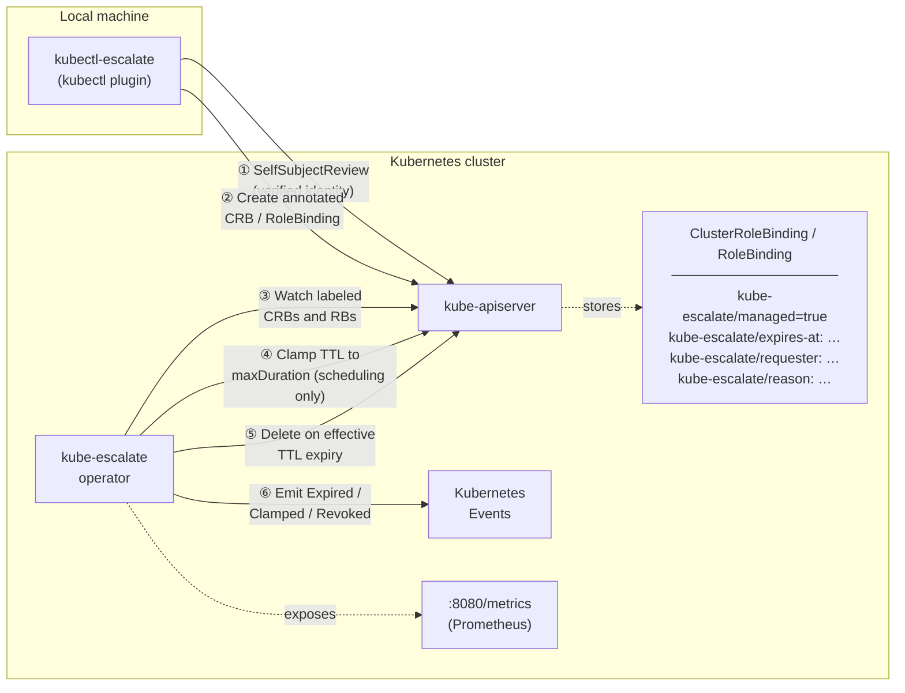

# Architecture

## Component diagram



## Escalation lifecycle

1. **Plugin** calls `AuthenticationV1().SelfSubjectReviews().Create()`.
   The API server populates `Status.UserInfo.Username` and `Status.UserInfo.Groups`
   from the validated token — this value cannot be forged by the caller.

2. **Plugin** creates a `ClusterRoleBinding` (or `RoleBinding` for `--namespace`)
   annotated with the expiry timestamp, requester identity, and reason.
   The binding immediately grants the requested role.

3. **Operator** watches both `ClusterRoleBinding` and `RoleBinding` objects
   labelled `kube-escalate/managed=true` via a controller-runtime predicate
   filter. Unmanaged bindings are never enqueued.

4. On first reconcile the operator computes the **effective expiry** as
   `min(requested expires-at, CreationTimestamp + maxDuration)`. If the
   requested TTL exceeded `maxDuration` (default `24h`), it emits a
   `Warning/EscalationClamped` event. **The `kube-escalate/expires-at`
   annotation itself is never rewritten** — see
   [Known limitations](#known-v1-limitations) for why. The finalizer-only
   `Update` that adds `kube-escalate.layer87.de/cleanup` and records creation
   metrics is the only write made on this reconcile.

5. **Subsequent reconciles** recompute the same effective expiry from
   `CreationTimestamp + maxDuration` and requeue exactly at
   `effectiveExpiresAt + 1 s`. No polling window, no grace period.

6. **Effective TTL elapsed** — operator calls `Delete`; because the finalizer
   is present the API server sets `DeletionTimestamp` instead of removing the
   object.

7. **Finalization** — operator recomputes the effective expiry once more and
   checks whether `now > effectiveExpiresAt`:
   - **Yes** → `Warning/EscalationExpired` event, `RecordExpiry` metrics
   - **No** (manual revocation via `revoke`) → `Normal/EscalationRevoked` event, `RecordRevocation` metrics
   Finalizer removed; object is garbage-collected.

## Finalizer lifecycle

```
reconcile 1   → compute effective expiry (clamp if needed) → add finalizer
                (finalizer-only Update) + RecordCreation
                → EscalationClamped event if the request was clamped
reconcile N   → TTL not elapsed → requeue at effective expiry + 1 s
reconcile N   → TTL elapsed    → client.Delete (sets DeletionTimestamp)
reconcile N+1 → DeletionTimestamp set → handleFinalization:
                  now > effective expiry  → EscalationExpired  + RecordExpiry
                  now ≤ effective expiry  → EscalationRevoked + RecordRevocation
                remove finalizer (finalizer-only Update)
                → object garbage-collected
```

### Why `expires-at` is never rewritten

Kubernetes' RBAC privilege-escalation check treats **any** `Update` to a
managed `ClusterRoleBinding`/`RoleBinding` — even one that only touches an
unrelated annotation — as if the caller were granting the binding's
`RoleRef`. The operator's own ServiceAccount deliberately does not hold the
permissions of every role users might escalate to (that's the whole point of
running it least-privilege), so an `Update` that rewrote `expires-at` to the
clamped value would be rejected by the API server, permanently breaking that
reconcile. The one exception, verified live in production, is a
**finalizer-only** `Update` — Kubernetes exempts pure finalizer changes from
that check. The operator therefore never writes `expires-at`; it recomputes
the effective, possibly-clamped expiry from `CreationTimestamp + maxDuration`
on every reconcile instead, and every write it makes stays finalizer-only.

## Security model

| Property | Enforcement |
| --- | --- |
| **Tamper-proof identity** | Requester read from `SelfSubjectReview` — populated by the API server, never from CLI arguments |
| **Automatic expiry** | Reconciler requeues at the exact effective-expiry instant; no polling gap |
| **Least-privilege operator** | ClusterRole grants only `get/list/watch/update/patch/delete` on `clusterrolebindings`/`rolebindings` — the operator can never *create* a binding |
| **TTL ceiling** | Operator clamps any requested `expires-at` beyond `maxDuration` (default `24h`) on every reconcile, enforced server-side without an admission webhook |
| **No admission webhook required for the base guarantee** | The TTL/deletion guarantee has no availability dependency on an admission component; if the operator restarts, existing bindings remain until it reconciles again. (The *hardening* layer below does add an optional `ValidatingAdmissionPolicy` — see [Hardening](./hardening).) |
| **No CRD** | Uses standard `rbac.authorization.k8s.io/v1` — works on any Kubernetes 1.26+ cluster |
| **No database** | All state lives in Kubernetes etcd |
| **Audit trail** | Every expiry, revocation, and clamp emits a Kubernetes Event; requester and reason are stored as annotations. Events expire in ~1h — see [Observability & audit](./usage#observability--audit) for retaining a real audit trail. |
| **RBAC boundary, not an internal allow-list** | kube-escalate enforces no allow-list of who may escalate to what — that is entirely native Kubernetes RBAC (`bind`, `resourceNames`) plus the hardening policy. See [Installation](./installation#rbac-prerequisites) and [Hardening](./hardening). |

## Prometheus metrics

All metrics are exposed on `:8080/metrics` by the operator and labelled
`{user, role, namespace}`.

| Metric | Type | Description |
| --- | --- | --- |
| `kube_escalate_active_escalations` | Gauge | Currently active escalations |
| `kube_escalate_escalations_total` | Counter | Total escalations created |
| `kube_escalate_expired_total` | Counter | Escalations deleted by TTL |
| `kube_escalate_revoked_total` | Counter | Escalations manually revoked |
| `kube_escalate_duration_seconds` | Histogram | Duration of completed escalations |

## Bootstrap order

```
1. Operator deployed (helm install)
   └─ Creates: ServiceAccount, ClusterRole, ClusterRoleBinding, Deployment

2. User (or group) has RBAC to use the plugin
   └─ Needs: create on selfsubjectreviews
             create + bind (scoped via resourceNames) on
             clusterrolebindings/rolebindings and clusterroles/roles
   └─ See Installation → RBAC prerequisites. This step is easy to forget
      entirely — deploying only the operator leaves it unreachable by
      anyone, since it grants nothing itself.

3. (Strongly recommended) ValidatingAdmissionPolicy deployed
   └─ Closes the gap RBAC alone leaves open: `create` on bindings cannot be
      scoped by resourceNames, so without this a grantee could create an
      unmanaged (non-expiring) binding or one naming a different subject.
      See Hardening.

4. Target role exists in the cluster
   └─ e.g. cluster-admin (built-in) or a custom ClusterRole
      The plugin only binds existing roles — it never creates them.
```

The plugin does **not** require the operator to be running at escalation time.
If the operator is down, the binding is created but will not be automatically
deleted until the operator restarts and reconciles. This is a deliberate
trade-off: escalation availability is prioritised over expiry precision.

## Known v1 limitations

| Limitation | Notes |
| --- | --- |
| **`status` can show a stale TTL when clamped** | The operator never rewrites `expires-at` (see above), so `kubectl escalate status` may display the originally requested TTL rather than the enforced one. Check for an `EscalationClamped` event for the real effective expiry. |
| **No multi-person approval workflow** | `kubectl escalate` is single-step and self-service by design; layer approval in front of the RBAC/group-membership layer if you need it. |
| **One global TTL ceiling** | `maxDuration` applies cluster-wide; there's no per-role or per-user policy within kube-escalate itself. |
| **Standard NetworkPolicy + Cilium** | Clusters with Cilium `kube-proxy-replacement=true` require a `CiliumNetworkPolicy` with `toEntities: [kube-apiserver]` instead of a standard `NetworkPolicy`. |
| **Kubernetes Events expire (~1h)** | Not a retrospective audit log on their own — ship the operator's structured logs to a log store (e.g. Loki) for durable audit. See [Observability & audit](./usage#observability--audit). |
