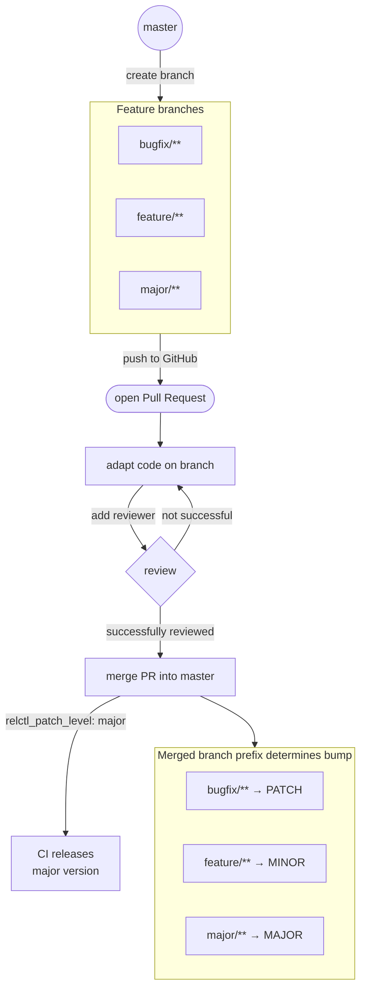
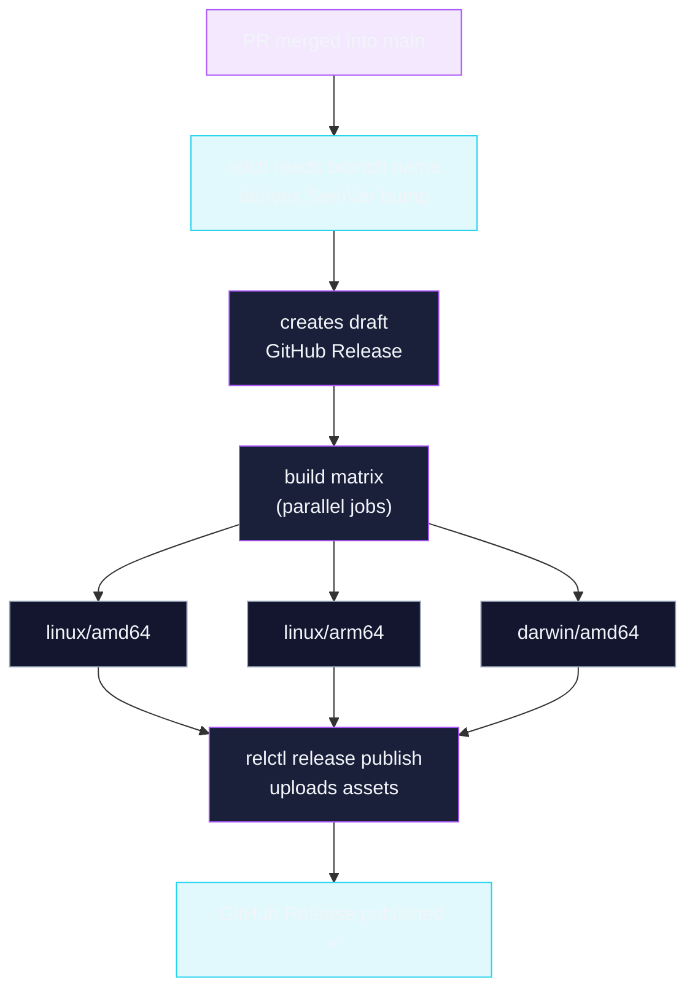

# CI Integration

### PR & branch workflow



### CI release pipeline



## GitHub Actions

### Minimal setup

Install `relctl` via the official action, then use it in your steps:

```yaml
- uses: layer87-labs/relctl-action@v1
  with:
    github-token: ${{ secrets.GITHUB_TOKEN }}

- name: Create release
  run: relctl release create --merge-sha ${{ github.sha }}
  env:
    GITHUB_TOKEN: ${{ secrets.GITHUB_TOKEN }}
```

### Reusable workflows (all-in-one)

`relctl-action` ships two ready-made reusable workflows that cover the most common CI patterns — no boilerplate needed.

#### `generate-build-infos` — PR metadata for build jobs

Use this on every pull request to derive the build version, SHA, branch, and semver bump level:

```yaml title=".github/workflows/ci.yaml"
jobs:
  build-info:
    uses: layer87-labs/relctl-action/.github/workflows/generate-build-infos.yml@v1
    secrets:
      token: ${{ secrets.GITHUB_TOKEN }}

  build:
    needs: build-info
    runs-on: ubuntu-latest
    steps:
      - uses: actions/checkout@v6
      - name: Build
        run: make VERSION="${{ needs.build-info.outputs.version }}"
```

Available outputs: `pr`, `sha`, `sha-short`, `branch`, `owner`, `repo`, `patch-level`, `version` (`<next>-pr-<number>`), `latest-version`, `next-version`.

#### `create-release` — Full release from merged PR

Runs `relctl pr info` + `relctl release create` in one job:

```yaml title=".github/workflows/release.yaml"
jobs:
  release:
    uses: layer87-labs/relctl-action/.github/workflows/create-release.yml@v1
    secrets:
      token: ${{ secrets.GITHUB_TOKEN }}

  publish:
    needs: release
    runs-on: ubuntu-latest
    steps:
      - uses: layer87-labs/relctl-action@v1
        with:
          github-token: ${{ secrets.GITHUB_TOKEN }}

      - name: Publish release
        run: |
          relctl release publish \
            --release-id "${{ needs.release.outputs.release-id }}" \
            --asset "file=out/myapp_${{ needs.release.outputs.version }}_linux-amd64"
        env:
          GITHUB_TOKEN: ${{ secrets.GITHUB_TOKEN }}
```

Available outputs: `release-id`, `sha`, `sha-short`, `owner`, `repo`, `version`, `latest-version`, `next-version`.

---

### Full release workflow (manual steps)

Three-job pattern: create draft → build matrix → publish with assets.

```yaml title=".github/workflows/release.yaml"
name: Publish Release

on:
  push:
    branches:
      - main

jobs:
  create_release:
    runs-on: ubuntu-latest
    outputs:
      release-id: ${{ steps.tag.outputs.RELCTL_RELEASE_ID }}
      version: ${{ steps.tag.outputs.RELCTL_NEXT_VERSION }}
    steps:
      - uses: actions/checkout@v6

      - uses: layer87-labs/relctl-action@v1
        with:
          github-token: ${{ secrets.GITHUB_TOKEN }}

      - name: Create release
        id: tag
        run: relctl release create --merge-sha ${{ github.sha }}
        env:
          GITHUB_TOKEN: ${{ secrets.GITHUB_TOKEN }}

  build:
    runs-on: ubuntu-latest
    needs: create_release
    strategy:
      matrix:
        arch: [amd64, arm64]
    steps:
      - uses: actions/checkout@v6

      - uses: actions/setup-go@v5
        with:
          go-version-file: go.mod

      - name: Build ${{ matrix.arch }}
        run: make VERSION="${{ needs.create_release.outputs.version }}"
        env:
          GOOS: linux
          GOARCH: ${{ matrix.arch }}

      - uses: actions/cache@v4
        with:
          path: out/
          key: build-${{ github.sha }}-${{ matrix.arch }}

  publish_release:
    runs-on: ubuntu-latest
    needs: [create_release, build]
    steps:
      - uses: actions/checkout@v6

      - uses: layer87-labs/relctl-action@v1
        with:
          github-token: ${{ secrets.GITHUB_TOKEN }}

      - uses: actions/cache@v4
        with:
          path: out/
          key: build-${{ github.sha }}-amd64

      - uses: actions/cache@v4
        with:
          path: out/
          key: build-${{ github.sha }}-arm64

      - name: Publish release
        run: |
          relctl release publish \
            --release-id "$RELCTL_RELEASE_ID" \
            --asset "file=out/myapp_${{ needs.create_release.outputs.version }}_linux-amd64" \
            --asset "file=out/myapp_${{ needs.create_release.outputs.version }}_linux-arm64"
        env:
          GITHUB_TOKEN: ${{ secrets.GITHUB_TOKEN }}
          RELCTL_RELEASE_ID: ${{ needs.create_release.outputs.release-id }}
```

### Step outputs

After `relctl release create`, these outputs are set in `$GITHUB_OUTPUT`:

| Variable              | Description                     |
| --------------------- | ------------------------------- |
| `RELCTL_NEXT_VERSION` | Computed next SemVer version    |
| `RELCTL_RELEASE_ID`   | GitHub release ID of the draft  |
| `RELCTL_PR_SHA`       | Full merge commit SHA           |
| `RELCTL_PR_SHA_SHORT` | Short (7-char) merge commit SHA |

### Hotfix release

```yaml
- name: Create hotfix release
  run: relctl release create --hotfix --merge-sha ${{ github.sha }}
  env:
    GITHUB_TOKEN: ${{ secrets.GITHUB_TOKEN }}
```

### Force a specific bump

```yaml
- name: Create release (force minor bump)
  run: relctl release create --patch-level minor --merge-sha ${{ github.sha }}
  env:
    GITHUB_TOKEN: ${{ secrets.GITHUB_TOKEN }}
```

---

## Jenkins Pipeline

```groovy
pipeline {
  environment {
    GITHUB_REPOSITORY = 'my-org/my-repo'
    GITHUB_TOKEN      = credentials('github-token')
  }
  stages {
    stage('Install relctl') {
      steps {
        sh '''
          curl -fsSL -o relctl \
            https://github.com/layer87-labs/relctl/releases/latest/download/relctl_linux-amd64
          chmod +x relctl
          mv relctl /usr/local/bin/relctl
        '''
      }
    }
    stage('Create Release') {
      steps {
        sh 'relctl release create'
      }
    }
  }
}
```

Required Jenkins environment variables:

| Variable            | Source                              |
| ------------------- | ----------------------------------- |
| `CI`                | Set automatically by Jenkins        |
| `JENKINS_URL`       | Set automatically by Jenkins        |
| `GIT_URL`           | Set by the GitHub Plugin            |
| `GITHUB_REPOSITORY` | Must be set manually (`owner/repo`) |
| `GITHUB_TOKEN`      | Set via credentials binding         |
