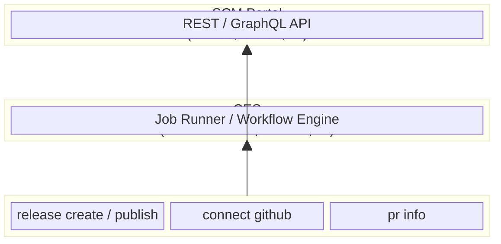

# Contributing

When contributing to this repository, please first discuss the change you wish to make via issue or any other method with the owners before making a change.

## Pull Request process

1. Remove any install or build artifacts before submitting.
2. Update documentation with details of any interface changes (new flags, env vars, etc.).
3. Make sure your branch starts with a SemVer alias prefix — e.g. `bugfix/`, `feature/`, `major/`.
4. A PR requires sign-off from at least one other developer before merging.

## Branch naming

| Prefix | SemVer bump |
| --- | --- |
| `major/` | Breaking change → MAJOR |
| `feature/` or `feat/` or `minor/` | New functionality → MINOR |
| `fix/` or `bugfix/` or `patch/` | Bug fix → PATCH |
| `dependabot/` | Dependency update → PATCH |

## Internal naming conventions

| Term | Meaning |
| --- | --- |
| `ces` | Code Execution Service (GitHub Actions, Jenkins, etc.) |
| `scm-portal` | Source control management portal (GitHub, GitLab, etc.) |

### Abstraction of layers

## Code of Conduct

See the shared [Code of Conduct](/docs/code-of-conduct) for all layer87-labs projects.
